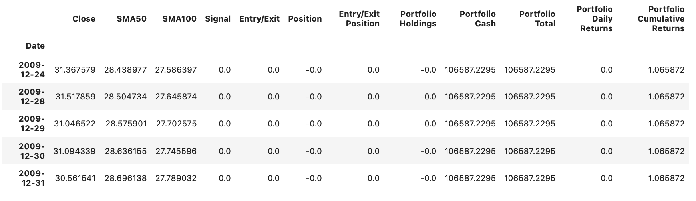
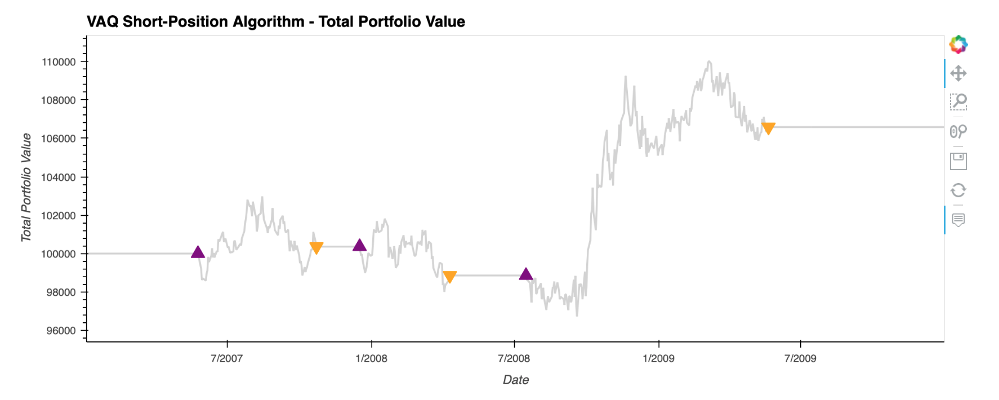

# Backtesting short position algorithm
This projects backtests the short term postion algorithm to trade VNQ stock during the 2008 recession. 

# Dataset
The dataset contains the VNQ security price from 01/03/2007 till 31/12/2009

# Required libraries and dependencies
``` python
import numpy as np
import pandas as pd
import hvplot.pandas
from pathlib import Path
```


# Examples 

Evaluation of the trading algorithm by using historical stock data



---

Total portfolio value with entry and exit points



# Summary 
Although the value of the portfolio did fall below the initial investment of 100,000, the drop in the stock price in 2008 and 2009 benefited the algorithm's short-position strategy and the portfolio did make money. The trading algorithm made $106587.22 on an initial investment of $100000
# License 
MIT 